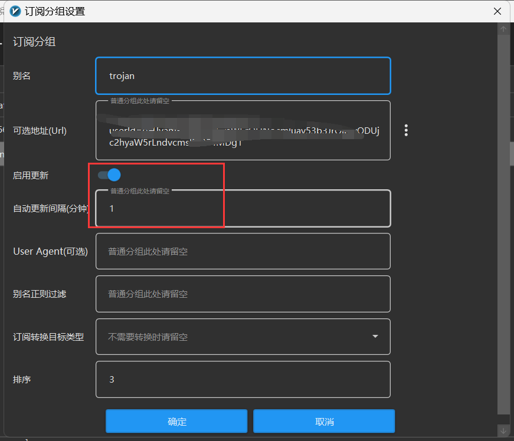

> 本项目是在https://github.com/Jrohy/trojan 基础之上做的
# 搭建trojan服务端流程注意点：

1. 用cloudflare warp分流以访问ChatGPT，参考链接： https://p3terx.com/archives/cloudflare-warp-configuration-script.html 。

2. 为了防止gfw屏蔽域名和端口，使用动态域名和端口的办法：

   > 由于长时间使用同一个域名+端口会被gfw屏蔽，故需要更换域名和端口，但是手动更换域名和端口太麻烦，故采用动态域名和端口的方法。
   >
   > 原理：[V2RayN](https://github.com/2dust/v2rayN)定期地访问一个应用来获取最新的trojan地址（主要是域名和端口变化），然后用拿到的地址去访问trojan，这个过程中由于trojan域名和端口不是固定的，所以gfw很难针对域名和端口去屏蔽。

   1. V2RayN开启动态更新服务器列表

      1. 需要一个应用来负责给V2RayN返回动态域名和端口（参考本项目代码）

          1. 端口就是随机生成一个10000-50000之间的端口

          2. 域名：把域名存放在数据库里，每次请求过来都从数据库里读取多个域名，然后随机选择一个作为目标域名。

              > 前提：域名要能解析到VPS且要在trojan配置文件中指定域名对应的证书路径

      2. V2RayN操作如下
          

           > 其中填的Url： http://应用的ip:port?userId=xxxxx，其中userId值为trojan用户订阅链接base64编码之后的值。

   2. 服务端转发（10000-50000转发到trojan运行端口8085），这样V2RayN访问10000-50000端口的时候会被转发到8085端口以被trojan接收。

      ```sh
      iptables -t nat -A PREROUTING -p tcp --dport 10000:50000 -j REDIRECT --to-ports 8085
      ```

   # 疑问

   trojan配置文件中只能指定一个证书路径，由于客户端会校验服务端给的证书是不是它请求的域名对应的证书，所以只有用生成那个证书的域名访问时才可以，其他域名都不行，所以导致trojan无法同时使用多个域名，不知道有没有什么办法让trojan可以支持同时多个域名可用？欢迎各位大牛不吝赐教！


